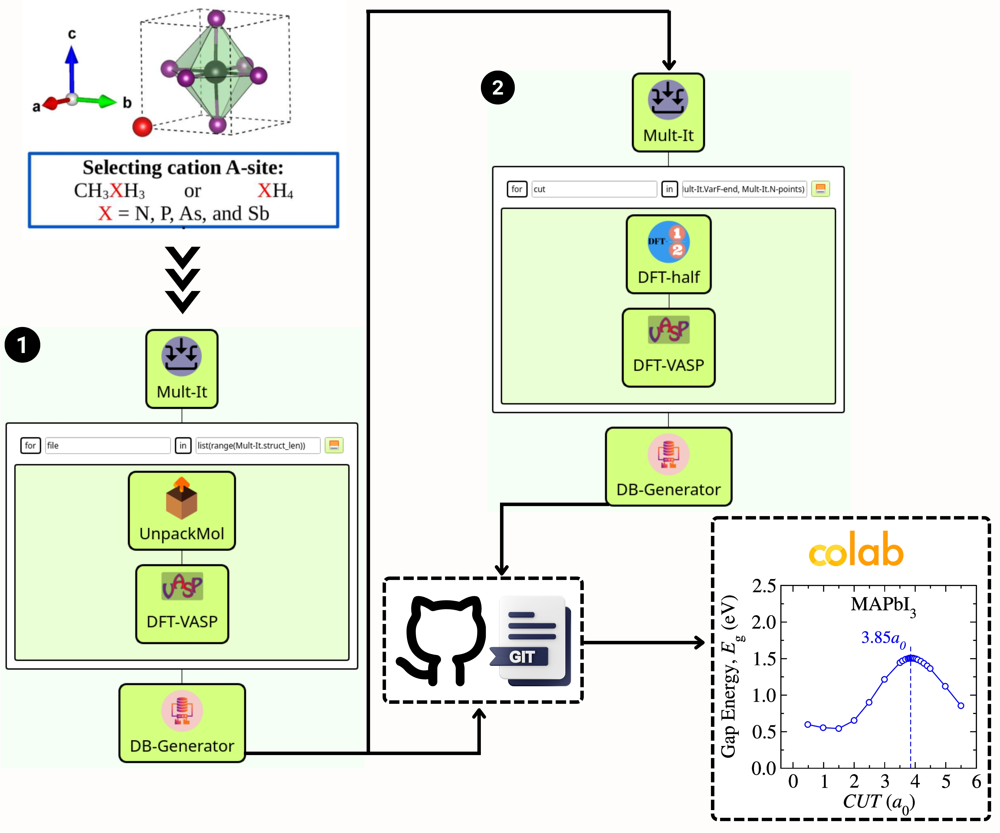

# Halide-Perovskites Workflow
When publishing results obtained with Halide-Perovskites workflow, please consider citing it.

# Colab
* Colab notebook for data visualization [](https://colab.research.google.com/drive/15NyTgjL0YmWqGlsjkcE7SGn8kc1nEjQt?usp=sharing)

This notebook calculates the thermodynamic properties and statistical attributes from the ab initio calculations executed from the Alloys Workflow. Below, we'd like to describe the functions the actual version covers.

# input_data Folder

The `input_data` folder contains the **converged POSCAR and INCAR input files** for all the geometries and structures studied in this project.

- **POSCAR Files**: Represent the structures' optimized atomic positions and lattice parameters after convergence.
- **INCAR Files**: Contain the parameters and settings used for the VASP calculations to ensure structural optimization and electronic convergence.

This folder serves as a comprehensive archive of the critical inputs used to reproduce and validate the results of the computational simulations performed in this study to assess the Empirical and Semi-Empirical van der Waals Methods for the Halide Perovskites in the Density Functional Theory Approach.

In this workflow, the SimStack framework is used to analyze the electronic and structural properties of metal halide perovskites (MHPs) with chemical formula CH<sub>3</sub>XH<sub>3</sub>PbI<sub>3</sub> (X = N, P, As, and Sb) For this, five different **WaNos** were combined: Mult-It, UnpackMol, DFT-VASP, DFT-half and DB-Generator. A table containing the total energies and structural parameters is the expected output of this protocol.

To create the workflow depicted in **Figure 1**, you must use the drag-and-drop standard procedure of Simstack in four steps. First, Mult-It **Wano** was used to create a tar file of all investigated structures. In the second step, we add the Unpackmol **Wano** inside AdvancedFor loop control to generate the POSCAR files corresponding to the unit cells. In the third step, we insert the DFT-VASP **Wano** to receive the POSCAR files from the preceding step and execute the DFT calculations. In this step, we must choose the corresponding van der Waals method, such as D2, D3, D3BJ, TS, TSSCS, MBD, and dDsC. At the end of the protocol, DB-Generator **WaNo** extracts in a yml file the total energy from the OUTCAR file associated with each composition investigated.

 ### This workflow allows us to:
```
1. From several initial structures, calculate in an automated way several of their properties, such
as stability gap energy, among others.
2. Compress all structures in the tar file above with Mult-It and uncompress them with UnpackMol.
2. Run the DFT calculations using VASP code (DFT-VASP).
4. Arrange all the total energy values gap energies for a given number of atomic substitutions in a yml file at the end of the protocol (DB-Generator). 
```

 ## Halide perovskites workflow with **_AdvancedFor_** loop control

 

**Figure 1** _This workflow aims to perform several DFT calculations of metal halide perovskites with vdW corrections. It is made from Mult-It, UnpackMol, DFT-VASP, and DB-Generator **WaNos** and is connected by the AdvancedFor loop control. In step 1, we generate the configurations containing different cations within the cuboctahedral voids of the MHP structure, represented in red. Steps 2 and 3 define the group of configurations and set the DFT calculation methods employed in the simulation. In the last step, DB-Generator **Wano** extracts the required variables of the output files from the previous steps. After this, the DFT-half is used to_

## 1. Python Setup
To get this workflow up and running on your available computational resources, you can just install the below libraries on Python 3.6 or newer.

```
1. Atomic Simulation Environment (ASE).
2. Python Materials Genomics (Pymatgen).
3. Numpy, os, sys, re, yaml, subprocess.
4. json, csv, shutil, tarfile. 
```

## 2. Mult-It Inputs

- You need to check the box *Structures*.
- In the tarfile field, configure the path containing the tarfile with input structures if it is not properly configured.

## 3. Mult-It Outputs

- Configure the' file' name from the `file` command on the top of the AdvancedFor loop, as indicated in **Figure 1**.
- From the *in* command on the top of the loop, configure `list(range(Mult-It.struct_len))`.

## 4. UnpackMol Inputs

- Check the box Multivariable-mode.
- The input-file variable should be set as `Mult-It/outputs/structure_output_dict.yml.`
- Structures-int variable should be set as `${file}.`
- Structures variable should be set as `Mult-It/outputs/Structures.tar.`

## 5. UnpackMol Outputs

- POSCAR files (named as Mol_geom.xyz) should be passed to DFT-VASP **WaNo**.

## 6. DFT-VASP Inputs

- **INCAR tab**: as an option, we can set all INCAR flags available within VASP. However, we expose only a few of them, which is essential for the problem. Please take a look at the GUI of this WaNo. A brief description of each flag pops up when we hover the mouse over the inputs.
- **KPOINTS tab**: Here, the user can define two types of KPOINTS, `Kpoints_length` and `Kpoints_Monkhorst.`
- **Analysis tab**: Aimed to compute Bader charge analysis and DOS.
- **Files_Run tab**: Mandatory loads the POSCAR file, and as an option, can load INCAR, POTCAR, KPOINTS, and KORINGA files. The KORINGA file can be any file. In the case of this problem, it loads the Input_data.yml file. *Poscar_file* variable should be set as `AdvancedForEach/${file_ITER}/UnpackMol/outputs/Mol_geom.xyz`.

## 7. DFT-VASP Outputs

- OUTCAR file.

## 8. DB-Generator Inputs

- **Imports tab**: Search_in_File variable should be set as vasp_results.yml and import this file using `AdvancedForEach/*/DFT-VASP/outputs/vasp_results.yml` command.
- Search_Parameters: Set the variables `total_energy` and `title`.

## 9. DB-Generator Outputs

- Table-dict.yml containing the variables defined in the Search_Parameters field above, as shown in **Figure 1**.

## Acknowledgements


## License & Copyright
  Developer: Celso Ricardo C. Rêgo, 
  Multiscale Materials Modelling and Virtual Design,
  Institute of Nanotechnology, Karlsruhe Institute of Technology
  https://www.int.kit.edu/wenzel.php

Licensed under the [KIT License](LICENSE).

